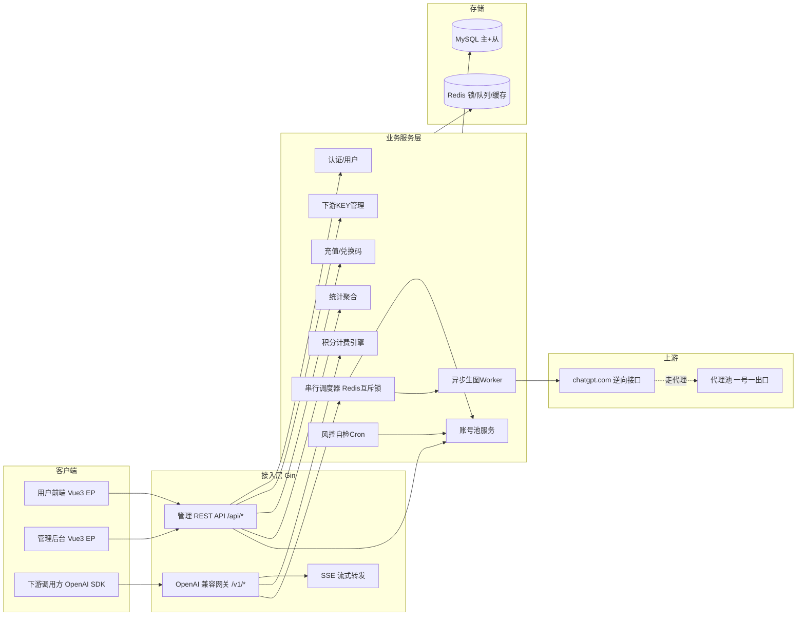
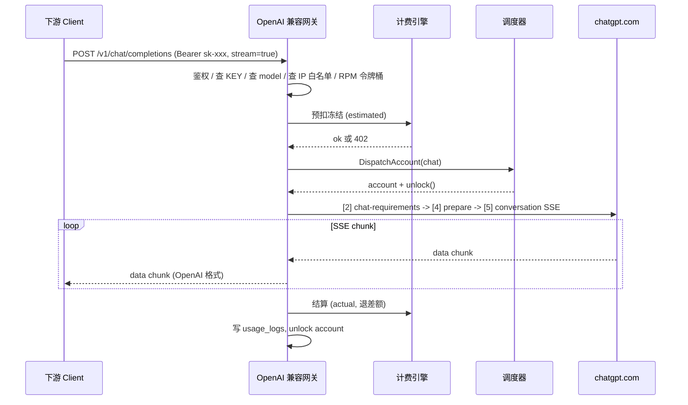
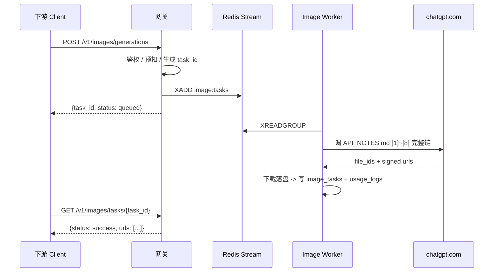
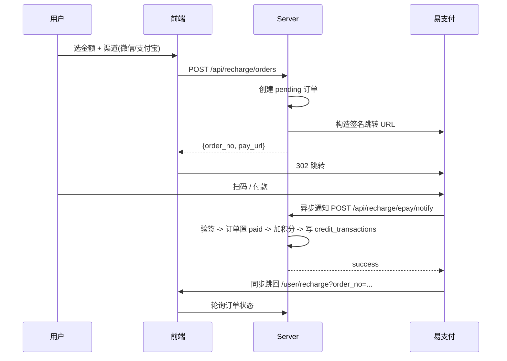

# 云芯 API 框架开发说明

> 本文是项目的顶层架构与开发约定,所有开发者在动工前必须通读。
> 姊妹文档:`[API_NOTES.md](../API_NOTES.md)`(上游接口细节)、`[RISK_AND_SAAS.md](../RISK_AND_SAAS.md)`(风控与调度原则)。
>
> 最后更新:2026-04-17

---

## 一、产品定位与核心决策


| 维度     | 决策                                                                                           |
| ------ | -------------------------------------------------------------------------------------------- |
| 模型来源   | 纯逆向 `chatgpt.com`,文字 + 生图共用同一账号池 / cookies 体系                                                |
| 下游协议   | 完全兼容 OpenAI 官方(`/v1/chat/completions`、`/v1/images/generations`、`/v1/models`)                 |
| 计费模型   | 统一「积分钱包」,文字按 token 折算、生图按张数折算;流式结束后一次性扣费,前置预扣冻结                                              |
| 生图形态   | 异步任务为主(`POST /v1/images/generations` 返回 `task_id` → `GET /v1/images/tasks/{id}`),保留同步模式做协议兼容 |
| KEY 粒度 | 全特性:额度、过期、模型白名单、IP 白名单、RPM/TPM、分组倍率                                                          |
| 角色模型   | 两级:普通用户 / 超级管理员                                                                              |
| 支付     | 易支付聚合(微信 + 支付宝)                                                                              |
| 后端     | Go 1.22+ / Gin / sqlx / MySQL 8.0 / Redis 7                                                  |
| 前端     | Vue 3 / Element Plus / ECharts / UnoCSS                                                      |


---

## 二、系统架构总览




---

## 三、目录结构

```text
gpt2api/
├── cmd/server/main.go          # 主入口
├── configs/
│   ├── config.yaml             # 真实配置(.gitignore)
│   └── config.example.yaml     # 模板,提交仓库
├── internal/
│   ├── config/                 # 配置加载(viper)
│   ├── db/                     # MySQL + Redis 连接管理
│   ├── model/                  # 数据模型 + DAO
│   ├── middleware/             # 鉴权/限流/日志/Recover
│   ├── gateway/                # OpenAI 兼容网关
│   ├── auth/                   # 登录注册、JWT
│   ├── user/                   # 用户 CRUD、积分余额
│   ├── apikey/                 # 下游 KEY
│   ├── account/                # chatgpt.com 账号池
│   ├── proxy/                  # 代理池
│   ├── scheduler/              # 账号调度器
│   ├── upstream/chatgpt/       # 逆向接口封装
│   ├── worker/image/           # 异步生图 Worker
│   ├── billing/                # 计费引擎
│   ├── payment/epay/           # 易支付
│   ├── redeem/                 # 兑换码
│   ├── risk/                   # 风控自检 Cron
│   ├── stats/                  # 统计聚合
│   ├── admin/                  # 超管接口
│   └── server/                 # HTTP 路由组装
├── pkg/
│   ├── crypto/                 # AES-256-GCM
│   ├── ratelimit/              # Redis 令牌桶
│   ├── lock/                   # Redis 分布式锁
│   ├── sse/                    # SSE 工具
│   ├── logger/                 # 日志封装(zap)
│   └── resp/                   # 统一响应结构
├── sql/
│   ├── schema/                 # 建表 DDL
│   └── migrations/             # goose 迁移脚本
├── web/
│   ├── user/                   # Vue3 用户端
│   └── admin/                  # Vue3 管理端
├── deploy/
│   ├── docker-compose.yml
│   ├── Dockerfile
│   └── nginx.conf
├── docs/
│   ├── FRAMEWORK.md            # 本文档
│   ├── API_NOTES.md            # 上游接口
│   └── RISK_AND_SAAS.md        # 风控原则
├── Makefile
├── go.mod
└── go.sum
```

---

## 四、模块职责


| 模块                          | 职责                                                            |
| --------------------------- | ------------------------------------------------------------- |
| `internal/gateway`          | 入口路由、协议解析、鉴权、分发上游                                             |
| `internal/auth`             | 注册、登录、JWT 签发/校验、2FA(可选)                                       |
| `internal/user`             | 用户信息、分组归属、积分读写                                                |
| `internal/apikey`           | 下游 KEY 生成、校验、权限(额度/白名单/RPM·TPM)                               |
| `internal/account`          | 账号 CRUD、AT/cookies 加密存储、健康状态机                                 |
| `internal/proxy`            | 代理 CRUD、一号一出口绑定、健康探测                                          |
| `internal/scheduler`        | 单号互斥锁、冷却、选号算法、每日熔断                                            |
| `internal/upstream/chatgpt` | 封装 `API_NOTES.md` 全部接口(init / prepare / conversation / files) |
| `internal/worker/image`     | 任务队列消费、SSE 监听、polling、下载、落盘                                   |
| `internal/billing`          | 预扣冻结、结算扣费、模型倍率、分组倍率                                           |
| `internal/payment/epay`     | 易支付对接、回调校验、订单状态机                                              |
| `internal/redeem`           | 兑换码生成、批量导出、核销                                                 |
| `internal/risk`             | `/conversation/init` 自检 cron、banner 监控                        |
| `internal/stats`            | 按小时 / 天聚合、Top 榜、Token 曲线                                      |
| `internal/admin`            | 超管接口:账号池、代理、模型、系统配置、公告                                        |


---

## 五、数据模型

所有表统一 `id bigint unsigned`、`created_at`、`updated_at`、`deleted_at`(软删除)。
积分单位 `厘`(1 元 = 10000 厘,避免浮点)。

### 5.1 用户 / 权限

- `users` — `id, email, password_hash, nickname, group_id, role(user/admin), status(active/banned), credit_balance, credit_frozen, version, last_login_at, last_login_ip`
- `user_groups` — `id, name, ratio(默认 1.0,VIP=0.8), daily_limit_credits, rpm_limit, tpm_limit`
- `api_keys` — `id, user_id, key_prefix, key_hash, name, quota_limit, quota_used, allowed_models(JSON), allowed_ips(JSON), rpm, tpm, expires_at, enabled, last_used_at`
- `credit_transactions` — `id, user_id, key_id, type(consume/recharge/refund/redeem/admin_adjust), amount, balance_after, ref_id, remark`

### 5.2 账号池

- `oai_accounts` — `id, email, auth_token_enc, refresh_token_enc, token_expires_at, oai_session_id, oai_device_id, plan_type, daily_image_quota, status(healthy/warned/throttled/suspicious/dead), warned_at, cooldown_until, last_used_at, notes`
- `oai_account_cookies` — `account_id, cookie_json_enc, updated_at`
- `proxies` — `id, scheme, host, port, username, password, country, isp, health_score, last_probe_at, enabled`
- `account_proxy_bindings` — `account_id(unique), proxy_id, bound_at`
- `account_quota_snapshots` — `account_id, feature_name, remaining, reset_after, snapshot_at`

### 5.3 模型 / 计费

- `models` — `id, slug, type(chat/image), upstream_model_slug, input_price_per_1m, output_price_per_1m, image_price_per_call, enabled`
- `billing_ratios` — `model_id, group_id, ratio`

### 5.4 请求 / 任务

- `usage_logs` — `id, user_id, key_id, model_id, account_id, request_id, type, input_tokens, output_tokens, cache_read_tokens, cache_write_tokens, image_count, credit_cost, duration_ms, status, error_code, ip, ua, created_at`(按月分表 `usage_logs_202604`)
- `image_tasks` — `id, task_id(uuid), user_id, key_id, account_id, prompt, n, size, status, conversation_id, file_ids, result_urls, error, created_at, started_at, finished_at`

### 5.5 充值 / 兑换

- `recharge_orders` — `id, order_no, user_id, amount, credits, channel, epay_trade_no, status, paid_at, callback_raw`
- `redeem_codes` — `id, code, batch_id, credits, used_by_user_id, used_at, expires_at`

### 5.6 系统

- `system_configs` — `key, value(JSON)`
- `announcements` — `id, title, content, level, enabled, start_at, end_at`
- `audit_logs` — `admin_id, action, target, diff(JSON), ip, created_at`

---

## 六、关键技术细节

### 6.1 账号池调度器

```text
DispatchAccount(modelType) -> (Account, Unlock, err)
  1. 从 Redis ZSet<status=healthy> 按 last_used_at 升序取候选
  2. 对候选逐个尝试 SET NX acc:lock:{id} worker_id EX 1200
  3. 首个抢到锁的即为调度结果(原子)
  4. 校验 cooldown_until、quota_remaining、今日消耗 < quota*60%
  5. 返回 unlock 闭包,业务 defer 释放
```

要点:

- 一号一锁(SETNX,兜底 20min)
- 最小间隔 60s(ZSet 存 `next_available_at`)
- 单号日消耗熔断 ≤ daily_quota × 60%
- 连续 3 次 429 → 自动冷却 10min
- `banner_info ≠ null` → 状态迁移 `warned`,暂停调度 24h

### 6.2 OpenAI 兼容网关 + SSE

- `POST /v1/chat/completions` 识别 `stream=true` 时,开 `http.Flusher` 边接收上游 SSE 边转发
- 上游 `conduit_token` / `chat_token` / `proof_token` 在网关层透明处理
- SSE 结束时统计 `input_tokens` / `output_tokens`,立即结算

### 6.3 积分预扣与结算

```text
进网关:
  estimated = max_tokens * price * ratio
  DB 事务: balance -= estimated; frozen += estimated (WHERE balance >= estimated AND version = v)
  失败 -> 402 Payment Required

调用完成:
  actual = 实际用量 * price * ratio
  DB 事务: frozen -= estimated; balance += (estimated - actual); version += 1
  写 usage_logs + credit_transactions
```

并发安全:乐观锁 `WHERE balance >= ? AND version = ?`,失败自动重试 3 次。

### 6.4 限流

- 网关令牌桶(Redis Lua 原子脚本),按 `key_id` 维度 RPM/TPM
- IP 白名单在中间件最前置,O(1) Redis Set 判定

### 6.5 异步生图

```text
HTTP -> Redis Stream(image:tasks) -> Worker consumer group
Worker -> 调度账号 -> 跑 API_NOTES.md [1]~[8] -> 落盘/S3 -> 写回 DB
客户端 GET /v1/images/tasks/{id}
```

### 6.6 风控自检 Cron

每小时扫描所有 `status=healthy` 账号,调 `/backend-api/conversation/init`,写 `account_quota_snapshots`,命中 `banner_info ≠ null` 或 `blocked_features ≠ []` 自动迁移状态并告警。

---

## 七、功能规范

> 所有菜单、页面、操作项必须按此清单实现。实现时序以第十章里程碑为准。

### 7.1 前端站点结构

```text
/                           公开首页(产品介绍、定价、登录入口)
/login  /register           登录 / 注册
/user/*                     用户中心(登录态)
/admin/*                    管理后台(admin 登录态)
```

用户中心与管理后台共用一套布局壳(侧边栏 + 顶部栏 + 主内容区),顶部栏与侧边栏**组件完全一致**,通过权限开关控制显示菜单项。

### 7.2 管理后台菜单(admin role 可见)


| 菜单    | 路径                     | 功能要点                                                                            |
| ----- | ---------------------- | ------------------------------------------------------------------------------- |
| 仪表盘   | `/admin/dashboard`     | 顶部 8 个指标卡 + 模型分布 + Token 趋势 + 最近使用 Top 12,支持时间范围与粒度切换                           |
| 运维监控  | `/admin/ops`           | 账号池健康分布饼图、代理池状态、队列深度(image / chat)、近 5 分钟 429/403 计数、SSE 活跃连接数                  |
| 用户管理  | `/admin/users`         | 用户列表(搜索 / 筛选 / 分页)、改分组、改积分、改状态、重置密码、查看调用流水                                      |
| 分组管理  | `/admin/groups`        | 分组 CRUD,设置倍率、日限额、RPM、TPM                                                        |
| 渠道管理  | `/admin/channels`      | **chatgpt.com 账号池**:新增账号(AT / cookies / device_id),一键绑定代理,查看状态机,手工冷却/启用/禁用,批量导入 |
| 订阅管理  | `/admin/plans`         | 付费订阅套餐(月付 / 季付 / 年付),配置赠送积分、KEY 数量上限、可用模型                                       |
| 账号管理  | `/admin/accounts`      | 注:与"渠道管理"分离。用于被封 / 警告 / 已死账号的归档回收站,含复盘字段                                        |
| 公告    | `/admin/announcements` | 公告 CRUD,支持 level(info/warn/danger)、定时上下线                                        |
| IP 管理 | `/admin/ip`            | IP 黑白名单,支持 CIDR,按 KEY / 全局两级                                                    |
| 兑换码   | `/admin/redeem-codes`  | 批量生成(面额 / 数量)、导出 CSV、作废、核销记录                                                    |
| 优惠码   | `/admin/coupons`       | 充值时抵扣码(与兑换码不同,是"充 100 送 20"类),绑定套餐                                              |
| 使用记录  | `/admin/usage`         | 全站调用流水,按用户 / KEY / 模型 / 账号 / 时间筛选,可导出                                           |
| 系统设置  | `/admin/settings`      | `system_configs` 的可视化编辑:注册开关、默认分组、新用户赠送积分、默认模型、公告栏、支付渠道开关、邮箱 SMTP               |


### 7.3 用户中心菜单(所有登录用户可见)


| 菜单     | 路径                   | 功能要点                                                                   |
| ------ | -------------------- | ---------------------------------------------------------------------- |
| 仪表盘    | `/user/dashboard`    | 个人积分余额、今日 / 本月 Token、活跃 KEY 数、最近 7 天用量图                                |
| API 密钥 | `/user/keys`         | KEY 列表、创建(名称 / 模型白名单 / IP 白名单 / 额度 / RPM / TPM / 过期),一次性展示明文,之后只存 hash |
| 使用记录   | `/user/usage`        | 按 KEY / 模型 / 时间筛选个人调用流水,显示 token / 积分 / 状态                             |
| 我的订阅   | `/user/subscription` | 当前订阅、到期时间、续费 / 升级入口                                                    |
| 兑换     | `/user/redeem`       | 输入兑换码领取积分,显示最近兑换历史                                                     |
| 充值     | `/user/recharge`     | 选金额 → 选支付渠道 → 跳转易支付 → 回跳展示结果                                           |
| 个人资料   | `/user/profile`      | 改昵称、改密码、改邮箱(邮件验证)、2FA(可选)                                              |


### 7.4 顶部栏与全局组件


| 组件             | 行为                                                   |
| -------------- | ---------------------------------------------------- |
| 云芯 Logo + 版本标签 | 点击回仪表盘,版本号从 `/api/meta/version` 拉                    |
| 通知铃铛           | 管理员推送公告 + 系统告警;角标显示未读数;点击弹出抽屉                        |
| 语言切换           | `CN ZH` / `EN`,`vue-i18n` 管理,切换后 `localStorage.lang` |
| 余额展示           | 仅用户中心/管理后台显示,积分换算 `厘 → 元`,每 30s 刷新                   |
| 用户头像           | 显示 UID + 角色(Admin / User),下拉:个人资料 / 退出               |
| 深色模式切换         | 底部侧边栏,切换后 `localStorage.theme` + EP 主题变量切换           |
| 侧边栏折叠          | 底部「收起」按钮,折叠后仅显示图标                                    |


### 7.5 核心业务流程

#### 7.5.1 下游调用 chat 流程




#### 7.5.2 下游调用生图流程(异步)




#### 7.5.3 充值流程




### 7.6 接口约定

- 所有业务接口走 `/api/*`,返回 `{code, message, data, trace_id}`,HTTP 状态仅用于 401/403/404/429/5xx 等框架级错误
- OpenAI 兼容接口走 `/v1/*`,**响应体 100% 贴合官方**(下游 SDK 零改动)
- 鉴权两套:
  - `/api/`* 用 JWT(`Authorization: Bearer <jwt>`)
  - `/v1/`* 用 API KEY(`Authorization: Bearer sk-xxxxxxxx`)
- 列表接口统一 `page`(1 起)、`page_size`(默认 20,最大 100),响应包 `{list, total, page, page_size}`
- 所有时间字段:输入接受 RFC3339,输出统一 ISO8601(带时区)

---

## 八、界面规范

> 对标 [dashboard-sample.png](../assets/dashboard-sample.png),所有前端页面在 code review 时按此检查。

### 8.1 设计令牌(Design Tokens)

以 CSS 变量落地在 `web/*/src/styles/tokens.css`,深色模式覆盖同名变量。

```css
:root {
  /* 品牌色 */
  --color-primary:          #3B82F6;
  --color-primary-hover:    #2563EB;
  --color-primary-soft:     #EBF2FF;

  /* 语义色 */
  --color-success:          #10B981;
  --color-warning:          #F59E0B;
  --color-danger:           #EF4444;
  --color-info:             #6B7280;
  --color-purple:           #8B5CF6;
  --color-pink:             #EC4899;
  --color-teal:             #14B8A6;

  /* 数据卡片图标底色(循环) */
  --card-icon-bg-1:         #E0E7FF;   /* 蓝紫 */
  --card-icon-bg-2:         #DCFCE7;   /* 绿 */
  --card-icon-bg-3:         #FEF3C7;   /* 黄 */
  --card-icon-bg-4:         #FEE2E2;   /* 红 */

  /* 文字 */
  --text-primary:           #111827;
  --text-secondary:         #4B5563;
  --text-tertiary:          #9CA3AF;
  --text-inverse:           #FFFFFF;

  /* 背景 */
  --bg-body:                #F9FAFB;
  --bg-surface:             #FFFFFF;
  --bg-sidebar:             #FFFFFF;
  --bg-hover:               #F3F4F6;

  /* 边框 */
  --border-default:         #E5E7EB;
  --border-subtle:          #F3F4F6;

  /* 阴影 */
  --shadow-card:            0 1px 3px rgba(0,0,0,0.04), 0 1px 2px rgba(0,0,0,0.03);
  --shadow-hover:           0 4px 12px rgba(0,0,0,0.08);

  /* 圆角 */
  --radius-sm:              4px;
  --radius-md:              6px;
  --radius-lg:              12px;
  --radius-xl:              16px;

  /* 字号 */
  --font-xs:                12px;
  --font-sm:                13px;
  --font-base:              14px;
  --font-md:                16px;
  --font-lg:                20px;
  --font-xl:                24px;
  --font-2xl:               30px;

  /* 间距 */
  --space-1: 4px;  --space-2: 8px;  --space-3: 12px;
  --space-4: 16px; --space-6: 24px; --space-8: 32px;
}

html.dark {
  --text-primary:     #F9FAFB;
  --text-secondary:   #D1D5DB;
  --text-tertiary:    #9CA3AF;
  --bg-body:          #0F172A;
  --bg-surface:       #1E293B;
  --bg-sidebar:       #0F172A;
  --bg-hover:         #334155;
  --border-default:   #334155;
  --border-subtle:    #1E293B;
  --color-primary-soft: rgba(59,130,246,0.16);
}
```

### 8.2 布局规范

- **应用壳**:左侧固定宽 `220px` 侧边栏(折叠后 `64px`),顶部 `56px` 栏,主区背景 `--bg-body`。
- **侧边栏**:白底或浅底,当前高亮项左侧 `3px` 主色竖条,图标 `20px` Tabler + 文本 `14px`,二级菜单缩进 `16px`。
- **主区容器**:`padding: 24px;`,最大宽 `1440px`,自适应。
- **卡片**:`background: var(--bg-surface); border-radius: 12px; box-shadow: var(--shadow-card); padding: 20px 24px;`
- **栅格**:基于 `el-row / el-col` 或 CSS Grid,每列间距 `16px`,响应断点 `768 / 1024 / 1280 / 1536`。

### 8.3 组件规范


| 组件     | 规范                                                                                                                                                                       |
| ------ | ------------------------------------------------------------------------------------------------------------------------------------------------------------------------ |
| 按钮     | 主按钮主色填充,次按钮白底主色描边;尺寸 `default(32px)` / `small(28px)` / `large(40px)`;禁用透明度 0.4;圆角 `6px`                                                                                  |
| 输入框    | 高度 `32px`,边框 `1px var(--border-default)`,聚焦 `2px var(--color-primary)` 内阴影,圆角 `6px`                                                                                      |
| 表格     | `el-table` 去默认边框,斑马纹关闭;表头 `var(--bg-hover)`、字号 `13px` 粗体;行高 `48px`;分页器右对齐                                                                                                |
| 标签     | 圆角 `4px`,字号 `12px`,高度 `22px`,按状态:healthy=绿、warned=黄、throttled=橙、suspicious=红、dead=灰                                                                                      |
| 数据卡片   | **固定结构**:左上彩色图标方块(`40x40`,圆角 `10px`,`--card-icon-bg-N` 背景+主色图标)、右侧主数字 `24-30px` 粗体、下方辅助文字 `12-13px` `--text-tertiary`                                                    |
| 图表     | ECharts 统一封装组件 `<BaseChart>`,主题色数组:`[#3B82F6, #10B981, #F59E0B, #8B5CF6, #EC4899, #14B8A6]`,tooltip 背景 `rgba(17,24,39,0.95)`,grid `left:48, right:16, top:32, bottom:36` |
| 对话框    | `el-dialog` 圆角 `12px`,头部加粗 16px,底部按钮右对齐,最大宽度按场景 `480 / 640 / 880`                                                                                                        |
| 空状态    | 统一 `<EmptyState>` 组件,插图 + 文案 + CTA 三段式,文案 `14px` `--text-secondary`                                                                                                      |
| 加载     | 页面级用骨架屏(`el-skeleton`),按钮/局部用 spinner,禁用全屏 loading 蒙层                                                                                                                    |
| 反馈     | `ElMessage` 右上角 3s 自动关闭;`ElMessageBox` 用于二次确认;**严禁**使用 `alert`/`confirm` 原生弹框                                                                                            |
| 顶部指标卡行 | 一屏固定 4 列(大屏)或 2 列(平板)或 1 列(手机),每卡高度 `96px`,两行布局(标签+图标 / 主数字+变化率)                                                                                                         |


### 8.4 图表规范

- 统一 ECharts 5.x,封装 `<ChartLine> <ChartPie> <ChartBar> <ChartArea>`
- 折线图默认 smooth + 面积填充(alpha 0.1)
- 饼图默认环形(内径 60%),中心显示总量,右侧图例表格(对齐截图效果)
- 双轴场景(Token 趋势 Input/Output 与 Cache Hit Rate):左轴数量(bytes 可读化),右轴百分比
- 所有图表左上角标题 `14px` 粗体 + 右上角操作区(时间切换 / 下载 / 切视图)
- 空数据时显示 `<EmptyState>`,**禁止**显示 `暂无数据` 小字

### 8.5 交互规范

- 危险操作(删除 / 禁用 / 清空)必须 `ElMessageBox.confirm`,标题红色图标
- 表单提交按钮 loading 态锁住,防重复点击
- 所有写操作成功后 toast `操作成功` + 自动刷新列表
- 分页、筛选、排序参数同步到 URL query,刷新保持状态
- 列表操作列固定 `查看 / 编辑 / 删除`,使用下拉菜单聚合 > 3 个操作
- 长文本(Token / Key / URL)默认 `text-overflow: ellipsis`,hover 展开 `<el-tooltip>` 完整值,点击复制提示 `已复制`
- 键盘:`Ctrl+K` 全局搜索,`Esc` 关闭弹框,表格支持 ↑↓ 选中

### 8.6 前端规范性约束

1. **严禁**内联样式写颜色 / 字号,必须走 token
2. **严禁**硬编码文案,国际化统一 `vue-i18n`,key 命名 `模块.页面.字段`
3. **严禁**直接用 `axios`,统一经 `src/api/request.ts` 封装(错误码分发 / 401 自动刷新 token)
4. 组件必须 TypeScript + `<script setup lang="ts">`,Props 必须显式定义类型
5. 路由懒加载,权限守卫统一在 `src/router/guards.ts`
6. 所有图表组件统一用 `<BaseChart>` 包装,不直接操作 echarts 实例

---

## 九、OpenAI 兼容接口清单


| 方法   | 路径                            | 说明                                     |
| ---- | ----------------------------- | -------------------------------------- |
| POST | `/v1/chat/completions`        | 文字对话,支持 stream                         |
| POST | `/v1/images/generations`      | 生图(异步,返回 task_id;支持 `sync=true` 退化为同步) |
| GET  | `/v1/images/tasks/{id}`       | 查生图结果(扩展接口)                            |
| GET  | `/v1/models`                  | 可用模型列表(按 KEY 白名单过滤)                    |
| POST | `/v1/embeddings`              | 预留                                     |
| GET  | `/v1/dashboard/billing/usage` | 兼容用法统计                                 |


---

## 十、里程碑


| 里程碑             | 工期    | 交付物                                                |
| --------------- | ----- | -------------------------------------------------- |
| M1 骨架           | 1 周   | 项目初始化、配置、DB 迁移、基础中间件、注册 / 登录、JWT                   |
| M2 文字网关         | 1.5 周 | 账号池 + 代理池 CRUD、调度器、`/v1/chat/completions` SSE、计费闭环 |
| M3 生图 Worker    | 1 周   | `image_tasks` 异步队列、封装 API_NOTES.md 完整链、下载落盘        |
| M4 下游 KEY 全特性   | 1 周   | 额度、白名单、RPM·TPM、分组倍率、过期                             |
| M5 计费 + 充值      | 1 周   | 积分流水、易支付、回调、兑换码、优惠码                                |
| M6 管理后台         | 2 周   | §7.2 全部 13 个菜单、§8 全部组件规范                           |
| M7 用户中心         | 1 周   | §7.3 全部 7 个菜单                                      |
| M8 风控 + 监控 + 压测 | 1.5 周 | 自检 cron、Prometheus 指标、告警、§11 压测达标                  |


---

## 十一、非功能指标与高并发容量设计

### 11.1 性能目标(硬指标)


| 指标                                 | 目标         |
| ---------------------------------- | ---------- |
| 并发 chat SSE 长连接                    | **≥ 2000** |
| 并发生图任务                             | **≥ 1000** |
| 轻请求 QPS(`/v1/models`、`/api/stats`) | 单实例 ≥ 3000 |
| P99 chat 首 token 时延                | < 2s       |
| P99 轻请求 RT                         | < 100ms    |
| 单实例稳定运行                            | ≥ 7 天无重启   |


### 11.2 容量估算(账号池规模硬约束)

> 这是逆向链路的**物理上限**,不是调参能绕过的。必须准备足量账号池。

**chat 侧**

- 账号最小间隔 `60s`(风控原则)
- 平均请求耗时 `10~20s`(typed streaming)
- 单账号 1 分钟可服务 **≤ 1 路**
- 2000 并发意味着「当前正在跑的有 2000 路」:
  - 若每路平均 15s,那每 60s 一个账号可跑 ≈4 路,需要 **≥ 500 个 healthy 账号**
  - 考虑冷却 / 警告 / 401 过期占比 30%,**建议池容量 ≥ 700**
  - 若严格 60s/次,则需要 **≥ 2000 个账号**(不建议)

**生图侧**

- 账号生图额度 `100~120 次/日`
- 单任务耗时 `60~120s`
- 单账号 1 小时可跑 **≤ 30 次**(60s 间隔)× `min(24, 日额度)`
- 1000 并发生图意味着「队列中 running = 1000」:
  - 若平均 90s/张,需要 **≥ 1000 个活跃账号**
  - 考虑 30% 损耗,**建议池容量 ≥ 1300**

**代理池**:与账号 1:1 绑定,**容量等同账号池**;同国家 ISP 均衡分布,单 IP 绑 1 账号。

**结论**:运营侧必须具备「每周稳定补充账号」的能力,管理后台要支持批量导入与健康下线后的自动补位。

### 11.3 架构层并发设计


| 层       | 设计                                                                                                   |
| ------- | ---------------------------------------------------------------------------------------------------- |
| Go 进程   | GOMAXPROCS 默认,单实例即可支持 2000+ SSE(goroutine per connection,开销低)                                        |
| HTTP 服务 | Gin + net/http,ReadHeaderTimeout=10s、WriteTimeout 针对 SSE 关闭、`MaxHeaderBytes=1MB`                     |
| SSE 连接  | 每路 1 goroutine + 1 `context.Context`,断线用 `c.Request.Context().Done()` 感知,避免 goroutine 泄漏             |
| MySQL   | 主从:写主、统计走从;**主库连接池 500**(`max_open_conns=500`,MySQL `max_connections=1000`);按月分表 `usage_logs_YYYYMM` |
| Redis   | Cluster 或 Sentinel 3 节点,`pool_size=500`,关键 Lua 脚本预加载减少 eval 开销                                       |
| 任务队列    | Redis Stream + consumer group,生图 Worker **水平扩展 8~16 实例**,每实例 pipeline 并行 64 任务                       |
| 账号锁     | Redis SETNX,key TTL 20min 兜底,续租脚本每 30s 刷新                                                            |
| 限流      | 令牌桶 Lua 原子,按 `key_id` / `user_id` / `ip` 三级,避免热 key 可对 `key_id` 分槽 `key_id:{hash%16}`                |
| 日志      | 异步批量写(`usage_logs` buffer 1000 条或 1s 刷盘),避免 SSE 热路径同步 IO                                             |
| 本地缓存    | `api_keys` / `models` / `user_groups` 等强读场景,进程内 `ristretto` 缓存 TTL 30s,通过 Redis pub/sub 做失效广播        |


### 11.4 部署形态

- **单节点起步**:1 × Server(4C8G)+ 1 × MySQL(8C16G)+ 1 × Redis(4C8G),可支撑 500 并发 chat SSE
- **目标形态**:
  - 2 × Server(8C16G,负载均衡,无状态)
  - 4~8 × Image Worker(4C8G,可在 Server 实例内作为独立 goroutine pool,也可独立部署)
  - 1 主 2 从 × MySQL(8C32G)
  - 3 节点 Redis Sentinel(4C8G)
  - Nginx 4C 做 SSE 友好反代(`proxy_buffering off`)
- 横向扩展时 Server / Worker 均无状态,靠 Redis / MySQL 协调

### 11.5 可观测性

- Prometheus 指标端点 `/metrics`,关键指标:
  - `gpt2api_http_requests_total{path,status}`
  - `gpt2api_sse_active_connections`
  - `gpt2api_image_queue_depth`
  - `gpt2api_account_status{status}`(healthy/warned/throttled/suspicious/dead 分布)
  - `gpt2api_upstream_429_total` / `gpt2api_upstream_403_total`
  - `gpt2api_credit_consume_total{model}`
- 链路:`request_id` 贯穿日志 / 响应头 / 上游请求
- 告警门槛:账号池 healthy 占比 < 50%、Redis 断开、MySQL 主库连接占用 > 80%

### 11.6 压测清单(上线前必过)

1. **chat 2000 并发 SSE** 30 分钟,P99 首 token < 2s、错误率 < 0.5%
2. **生图 1000 并发** 队列跑空 1 小时,成功率 > 95%
3. **积分并发扣费**:1000 用户同时发起 10 请求 × 10 轮,余额与流水对账无偏差
4. **账号池故障注入**:手工标记 50% 账号 dead,系统应自动降级且不雪崩
5. **Redis 主切换**:主挂 → 备接管,服务恢复时间 < 10s
6. **MySQL 慢查询**:全量扫描场景 EXPLAIN 覆盖,无索引缺失

---

## 十二、开发约定

1. **禁止在代码里裸写字符串密码 / Token**,必须走 `pkg/crypto`。
2. **禁止浮点金额**,一律用 `int64` 单位「厘」。
3. **所有数据库写操作必须走 DAO**,禁止在 handler 里直接拼 SQL。
4. **所有上游调用必须过调度器**,禁止直连 `chatgpt.com`。
5. **错误处理**:业务错误用 `pkg/resp` 统一结构 `{code, message, data}`,HTTP 状态码仅用于框架级错误。
6. **日志**:结构化日志(zap),关键字段 `request_id`、`user_id`、`key_id`、`account_id`、`model_id`。
7. **前端**:严格遵循 §8 界面规范与 §8.6 规范性约束,code review 以此为准。
8. **上线前必过冒烟 + 压测**:§11.6 + `[RISK_AND_SAAS.md](../RISK_AND_SAAS.md)` §7。

